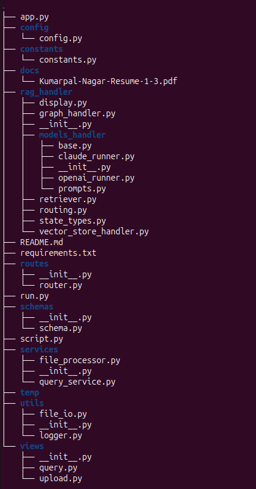

# RagAgent
# 🧠 AI Agent: Multi-Model RAG (OpenAI + Claude)

This is a Retrieval-Augmented Generation (RAG) AI agent that answers user questions using information from local PDF documents. 
It supports querying with **OpenAI**, **Claude**, or **both**, and routes responses accordingly. 
The agent uses FAISS for vector search and LangGraph for workflow orchestration.

---

## 📂 Project Structure


---

## 🛠️ Features

- 🔍 PDF-based document loading and chunking
- 🧠 Vector search using FAISS
- 🤖 Dual-model support: OpenAI (`gpt-3.5-turbo`) & Claude (`claude-3-5-sonnet-latest`)
- 🔁 Conversation history (last 3 Q&As)
- 📄 Fully local document storage, no external data dependency
- 🔧 LangGraph-based state machine for flow control

---

## 🚀 Setup

### 1. Clone the Repository

```bash
git clone https://github.com/kp-nagar/RAGAgent.git
cd RAGAgent
```

### 2. Create .env File
Create a .env file with your API keys as given in .env.example:
```commandline
OPENAI_API_KEY=
ANTHROPIC_API_KEY=
HOST=0.0.0.0
PORT=8001
```

### 3. Install Dependencies
We recommend using a virtual environment:

```commandline
python3 -m venv venv
source venv/bin/activate
pip install -r requirements.txt
```

### 📥 Add PDF Files
Place your PDF documents in the docs/ directory.
```commandline
NOTE: For Example I added my resume.
```

### ▶️ Run the Agent through script
```commandline
python script.py
```
---

# 🧠 AI Agent RAG API – FastAPI Version

This is a FastAPI-based AI Agent with **Retrieval-Augmented Generation (RAG)** capabilities. It allows users to:

1. **Upload PDF files** for indexing using FAISS.
2. **Query** the indexed documents using either **OpenAI**, **Claude**, or **both** models.

---

## 🚀 Features

- 📤 Upload and index one or multiple PDF files via `/api/v1/upload`
- ❓ Ask questions using `/api/v1/query`
- 🧠 Supports OpenAI (`gpt-3.5-turbo`), Claude (`claude-3-5-sonnet-latest`), or both
- 🔍 Document search using FAISS vector database
- ⚡ Powered by FastAPI for high-performance asynchronous APIs

---

### 🏃 Run the Server
Run the FastAPI app on port 8001:
```commandline
python run.py
```

### 🛠️ Configuration
Some default settings are defined in the constants.py file. You can modify these to suit your needs:
```commandline
VECTOR_DB_DIR = "fastapi_index"              # Directory where FAISS index is stored
OPENAI_MODEL = "gpt-3.5-turbo"               # OpenAI model used for responses
ANTHROPIC_MODEL = "claude-3-5-sonnet-latest" # Claude model used for responses
TEMP_DIR_STORE_FILES = "temp"                # Temporary folder to store uploaded PDF files 
```

### 📌 Notes
- You must call the /upload endpoint before /query unless index already exists.
- The vector index is persistent under faiss_index/.
- Responses are generated from uploaded documents only — no outside knowledge is used.